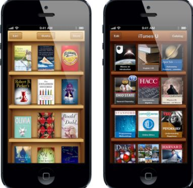
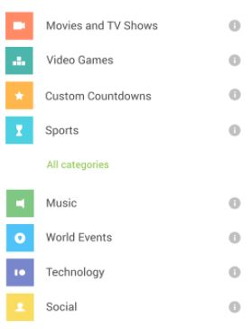
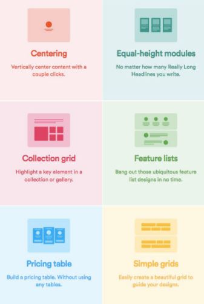
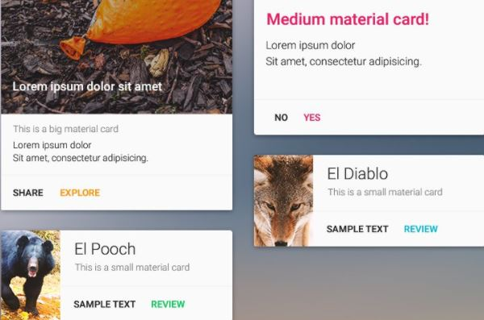

# Material Design
---

## 1 . 스큐어모픽 디자인

- 실물에 가까운 질감과 형태로써 사실적 표현을 하는 디자인
     
 
  

: 빈 공간이 생기면 들어가야할 것 같고 뭔가 입체감 느껴지고 이러한 느낌

단점 : Metaphor방식이기에 UI를 어디까지나 모티브에 의해 만들기엔 어려움이 있다.
또한 세세한 부분까지 신경쓰기에는 디바이스 리소스 측면에서 많은 비용을 감수해야 한다.

---

## 2 . 플랫디자인 

- 은유적인 부분에서 보다 현실적인 UI로 넘어온 디자인
- 어떻게 콘텐츠를 보기 쉽게 구현해야 하는가에 치중한 디자인

 

: 모던 UI / 간결한 타이포그래피 / 스탠다드형 UI 정의 

장점 

1. 플랫한 면에 보여줄 타이포그래피를 올린 디자인으로 비용이 적고 다양한 화면 크기를 지원할 수 있습니다.
2. 지역성이 약해 전 세계적으로 받아드리기 쉽다
3. 아이콘의 모티브가 추상화되어 가고 있고 아이콘과 플랫간의 경계가 없기 때문에 받아드리기 편합니다.

---

 

> Material Design ?

- 단순한 그릇 / 컨텐츠는 들어가 있지 않고 그 컨텐트를 보기 좋게 담기 위한 그릇입니다.

> Emptiness ?

- 빈 공간을 뜻하는 단어로 어떻게 공백을 두어 여지를 남길 지 표현해야 한다
- 사용자가 자유롭게 활용할 수 있도록 진행되어야 한다
- 인간 중심의 설계 / 목표주도형 설계입니다.

---

### 대표 컴포넌트 (Material Design) - 그릇

1. 리스트

   - 리스트 항목 좌우에는 이미지나 타임스탬프가 들어간다
   - 구별하기 쉬운 콘텐츠를 배치하여 다른 리스트 항목과 비교하도록 한다.
   - 뒤로 가기 버튼과 세트로 계층 구조를 나타내는 용도로 이용한다.
   - 오른쪽 긑에 아이콘 등으로 보조 액션을 배치하도록 한다.
   - 스와이프 액션을 두는 경우가 있는데 무작정 넣지말고 단축키나 추가 기능으로만 정의해주는 것이 좋다
 
  

 

 

2 . 그리드리스트
    - 이미지를 주로 사용하는 콘텐츠나 갱신되는 내용에 적합
    - 가로세로 균형 잡힌 콘텐츠를 셀 형태로 배치하기 때문에 긴 텍스트는 게시하기 힘듬
    - 액션은 셀 전체에 할당되며, 보조 액션을 배치하는 경우 네 모퉁이에 배치하는 것을 권장
    - 개별 셀마다 제스쳐 액션을 설정하는 것은 권장하지 않는다.

 

3 . 카드
 	
   - 세 줄 이상의 텍스트를 이용하거나 하나의 항목에 대해 즐겨찾기에 등록할 때 카드를 사용한다.
   - 가장 Material Design에 가까운 UI로서 종이를 모티브르 하고 있습니다.
   - 카드상의 버튼은 최대한 장식을 없애고, 아이콘이나 문자와 공백에 따라 액션 부분을 명가합니다.

    

   

---

### 버튼
---

1. 일반적인 버튼 : Floating Action Button , Raised Button , Flat Button
	- 다이얼로그 상자 안에서는 Flat Button을 활용 
		- 플랫한 면에 디자인 되어야 하기 때문에 애니메이션은 설정하지 않고 글자의 대소문자로 주위와 차이 나도록 디자인합니다.
	- 머터리얼 디자인(그릇) 내부의 컨텐츠로 들어간 버튼에서는 Raised Button 활용
		- 콘텐츠 내에서도 두드러지게 표현되어야 하기 때문 
	- Floating Action Button은 고정 스크롤로 있을 경우 사용
		- 앱의 에코 사이클을 최대화하는 액션에 이용
		- 예 : ) 메일 앱의 경우 전송처럼 메일 자체의 송수신량을 늘리고 이용 기회를 최대화 하는 액션에 어울림
		- 단점은 눈에 들어오게 배치된 버튼이더라도 스마트폰이 익숙하지 않은 사용자들은 버튼의 위치를 해메일 수 있습니다.

2. 토글 버튼 
	- 상태 전환 시에 사용한다.
	- 여러 토글 버튼을 그룹화해 표시할 수도 있다.
	- 아이콘을 이용하여 단일 전화을 가능하게 할 수도 있다.
	- 주의할 점은 일반 모티브로 이용할 경우 텍스트를 함께 적는 편이 낫다. 어떤 기능을 하는지 사용자가 모른다면 사용하는 의미가 없기 때문이다.

3. 드롭다운 버튼 
	- 여러 선택지를 선택할 수 있는 버튼
	- 선택 시에 버튼의 상태가 갱신된다
	- 드롭다운 버튼 내의 주위에는 여백을 두고 이용하는 것을 권장한다

---

### Elevation vs Shadow

Elevation : 높낮이 두는 속성

Shadow : 그림자 두는 속성 

- Shadow를 설정할 경우 배경을 지정할 떄 배경색에 투명도를 설정하면 안된다.

# CoordinatorLayout

---

: View 스크롤 시에 연동해서 자식이 될 view의 크기와 위치를 동적으로 관리하는 클래스 

# AppBarLayout

---
: LinearLayout을 상속한 Material Design의 AppBar 컨셉을 실현한 레이아웃 요소

> 구현 요소
> > app:layout_scrolFlags="scroll|exitUntilCollapsed" 
> > >  콘텐츠 영역을 아래로 스크롤 할 경우 AppBarLayout이 CollapsingToolbarLayout의 최소 높이 까지 작아지고 위로 스크롤 할 경우 최대 높이까지 확대 됩니다.

> > app:layout_scrolFlags="scroll|enterAlways" 
> > >  minHeight와 관계없이 콘텐츠 영역을 아래로 스크롤함에 따라 AppBarLayout이 작아지고 최종적으로는 표시가 되지 않습니다.

> > app:layout_scrolFlags="scroll|enterAlwaysCollapsed" 
> > >  minHeight와 관계없이 작아지지만 콘텐츠 영역의 맨 위로 스크롤한 뒤 다시 당기면 AppBarLayout이 표시됩니다. 

# CollapsingToolbarLayout
---
: AppBarLayout 바로 아래의 자식 요소로 AppBar의 확대 및 축소 표시를 위한 Toolbar의 wrapper

