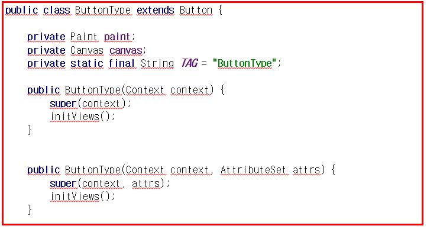
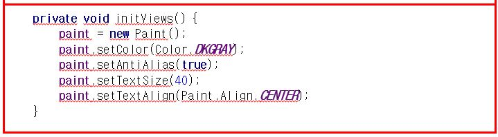
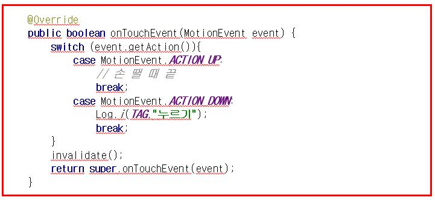
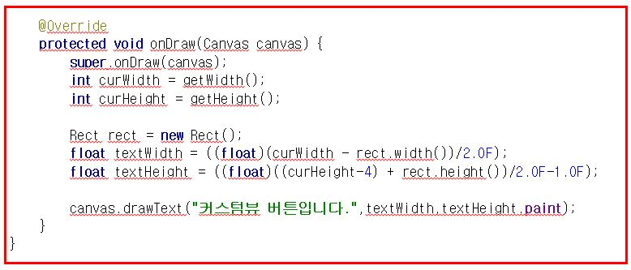

># NinePatch & Palette 
<hr />
<br />
<br />
<<<<<<< HEAD
# NinePatch 
---
=======

## NinePatch 


>>>>>>> b6cdf3068d8f2ff90d08cada70931d95a779bc15
### 1. 개념설명

> NinePatch 는 왜 쓸까요?
<hr />

- 이미지 왜곡을 막기 위해서
- 픽셀수는 단말에 따라 달라지기 때문에
- 실제 이미지가 크기의 변화에 따라 달라질 수 있기 때문에


### 2. NinePatch 사용 방법
<hr />

```

    (~~.xml)

    <LinearLayout
        android:layout_width="match_parent"
        android:layout_height="match_parent"
        android:layout_weight="1">

        <com.example.haams.pallete_ninepatch.ButtonType
            android:id="@+id/btnType"
            android:layout_width="match_parent"
            android:layout_height="50dp"
            android:layout_marginTop="20dp"
            android:padding="10dp"></com.example.haams.pallete_ninepatch.ButtonType>
    </LinearLayout>

```

:  커스텀뷰를 활용하여 위젯을 Java파일에서 정리

- xml에서는 위와 같이 자바파일과 연결시킨다.


<br />


```

      public class ButtonType extends Button {
            private Paint paint;
            private Canvas canvas;
            private static final String TAG = "ButtonType";


```

- Button을 상속하는 클래스를 하나 만든다. (위젯을 직접 그리기 위함) - [Bitmap / canvas]

<br />



- 그릴 속성들을 정의해준다 (paint)

<br />



- 그릴 때에 필요한 것은 onTouchEvent 그리고 onDraw 메소드입니다.
- MotionEvent.ACTION_DOWN 이 부분은 버튼 클릭으로 사용됩니다.
- invalidate()를 사용해서 onDraw()에 접목되도록 정의합니다.


<br />



> canvas.drawText( "텍스트","너비","높이","paint" ) 
> > - 버튼내의 내용을 그리게 됩니다.


<br />


# Palette
---

 > <a href="https://developer.android.com/reference/android/support/v7/graphics/Palette.html" > Palette 설명  (개발자 사이트 참조)</a> 


>### Palette 개념  
> - 동기적 vs 비동기적 구현 
> > 동기적 
     :  메인Thread의 성능에 영향을 줄 수 있기 때문에 백그라운드에서 사용되어야 한다.

     ``` 
         Palette p = Palette.from(bitmap).generate();

     ```
> > 비동기적 
    :  함수가 작동할 경우 바로 진행되기 때문에 메인Thread에 영향을 적게 준다. (추천)

   ```
	
	  Palette.from(bitmap).generate(new PaletteAsyncListener() {
     			public void onGenerated(Palette p) {
        		 // Use generated instance
     		 }
 		 });


   ```

> Glide와 연동한 Palette
  
   
 ```       
       
     Glide.with(this).asBitmap()
                .load(R.drawable.kakao)
                .into(new BitmapImageViewTarget(mImage) {
                    @Override
                    public void onResourceReady(Bitmap resource, Transition<? super Bitmap> transition) {
                        super.onResourceReady(resource, transition);

                        AsyncTask<Bitmap, Void, Palette> palette = Palette.from(resource).generate(new Palette.PaletteAsyncListener() {
                            @Override
                            public void onGenerated(Palette palette) {
                                setPalette(palette);
                              }
                         });
 
                      }
                   });
       }


 ``` 
### Swatch 

1. Palette가 가지고 있는 유용한 색상 값들을 불러 온다.

   - Vibrant
   - Vibrant dark
   - Vibrant light       
  (진한 느낌)
   - Muted
   - Muted dark
   - Muted light   
  (옅은 느낌)  
 <br />

2. Palette나 Swatch는 null로 올 가능성이 있기 때문에 null 체크를 반드시 해줘야 한다. (아래 코드처럼)
 <br />

3. Swatch에서 많이 쓰는 함수 
    - getRgb() : Vibrant로 설정할 경우 이미지에 해당하는 RGB색상 값을 가지고 온다.
    - getTitleTextColor() : 위의 RGB색상값에 잘 어울리는 제목 색상값을 가지고 온다.
    - getBodyTextColor() : 위의 RGB색상값에 잘 어울리는 본문 색상값을 가지고 온다.

 ```

    private void setPalette(Palette palette) {
        if (palette == null)
            return;

        Palette.Swatch vibrantSwatch = palette.getVibrantSwatch();

        if (vibrantSwatch != null) {
            color1.setBackgroundColor(vibrantSwatch.getRgb());
            colorText1.setTextColor(vibrantSwatch.getTitleTextColor());
        }

        Palette.Swatch darkVibrantSwatch = palette.getDarkVibrantSwatch();
        if (darkVibrantSwatch != null) {
            color2.setBackgroundColor(darkVibrantSwatch.getRgb());
            colorText2.setTextColor(darkVibrantSwatch.getBodyTextColor());
        }


        Palette.Swatch lightVibrantSwatch = palette.getLightVibrantSwatch();
        if (darkVibrantSwatch != null) {
            color3.setBackgroundColor(lightVibrantSwatch.getRgb());
            colorText3.setTextColor(lightVibrantSwatch.getBodyTextColor());
        }

        Palette.Swatch mutedSwatch = palette.getMutedSwatch();
        if (mutedSwatch != null) {
            color4.setBackgroundColor(mutedSwatch.getRgb());
            colorText4.setTextColor(mutedSwatch.getTitleTextColor());
        }

    }

 ```
<br />


# ButterKnife 
----

## ButterKnife 사용법 
> Build.graddle (Module:app) 에 추가 

```

    compile 'com.jakewharton:butterknife:8.7.0'
    annotationProcessor 'com.jakewharton:butterknife-compiler:8.7.0'

``` 

```
    

    @BindView(R.id.mImage)
    ImageView mImage;

    @BindView(R.id.color1)
    RelativeLayout color1;
    @BindView(R.id.color2)
    RelativeLayout color2;
    @BindView(R.id.color3)
    RelativeLayout color3;
    @BindView(R.id.color4)
    RelativeLayout color4;

    @BindView(R.id.colorText1)
    TextView colorText1;
    @BindView(R.id.colorText2)
    TextView colorText2;
    @BindView(R.id.colorText3)
    TextView colorText3;
    @BindView(R.id.colorText4)
    TextView colorText4;

``` 

- @BindView로 View를 바인딩해준다.
- 안에서 사용할 객체를 설정해 준다. 
   - 예:) TextView colorText1; (colorText1로 사용)


```

    @OnClick({R.id.color1,R.id.color2,R.id.color3,R.id.color4})
       public void moveIntent(View view){
          startActivity(new Intent(MainActivity.this,SubActivity.class));
    }

```

- @OnClick으로 아이디 값을 넘겨 준다. (해당 위젯들에 대한 클릭리스너) 

: ButterKnife는 뷰를 바인딩 한 뒤 해당 액티비티에서 사용하겠다고 바인드 선언을 하는 것이 중요하다. 

~~~


    @Override
       protected void onCreate(Bundle savedInstanceState) {
           super.onCreate(savedInstanceState);
           setContentView(R.layout.activity_main);
           ButterKnife.bind(this);
           // 반드시 현 액티비티에서 바인딩 하겠다고 정의해야함!
           bindViews();

    }

~~~


